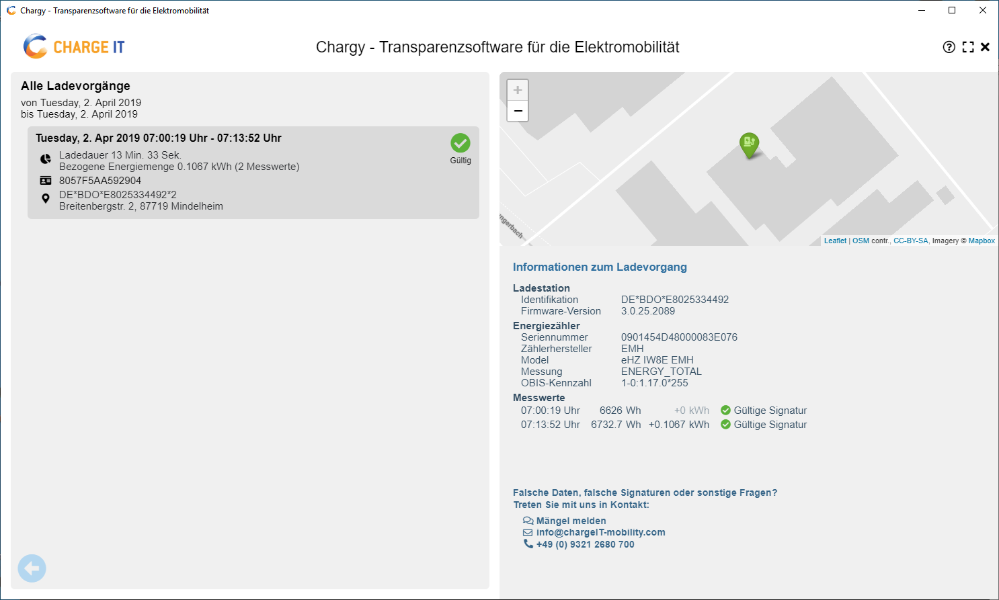

# Chargy Desktop App

Chargy is a transparency software for secure and transparent e-mobility charging processes, as defined by the German "Eichrecht". The software allows you to verify the cryptographic signatures of energy measurements within charge detail records and comes with a couple of useful extentions to simplify the entire process for endusers and operators.



## Benefits of Chargy

1. Chargy comes with __*meta data*__. True charging transparency is more than just signed smart meter values. Chargy allows you to group multiple signed smart meter values to entire charging sessions and to add additional meta data like EVSE information, geo coordinates, tariffs, ... within your backend in order to improve the user experience for the ev drivers.
2. Chargy is __*secure*__. Chargy implements a public key infrastructure for managing certificates of smart meters, EVSEs, charging stations, charging station operators and e-mobility providers. By this the ev driver will always retrieve the correct public key to verify a charging process automatically and without complicated manual lookups in external databases.
3. Chargy is __*platform agnostic*__. The entire software is available for desktop and smart phone operating systems and .NET. If you want ports to other platforms or programming languages, we will support your efforts.
4. Chargy is __*Open Source*__. In contrast to other vendors in e-mobility, we belief that true transparency is only trustworthy if the entire process and the required software is open and reusable under a fair copyleft license (AGPL).
5. Chargy is __*open for your contributions*__. We currently support adapters for the protocols of different charging station vendors like chargeIT mobility, ABL (OCMF), chargepoint. The certification at the Physikalisch-Technische Bundesanstalt (PTB) is provided by chargeIT mobility. If you want to add your protocol or a protocol adapter feel free to read the contributor license agreement and to send us a pull request.
6. Chargy is __*white label*__. If you are a supporter of the Chargy project you can even use the entire software project under the free Apache 2.0 license. This allows you to create proprietary forks implementing your own corporate design or to include Chargy as a library within your existing application (This limitation was introduced to avoid discussions with too many black sheeps in the e-mobility market. We are sorry...).
7. Chargy is __*accessible*__. For public sector bodies Chargy fully supports the [EU directive 2016/2102](https://eur-lex.europa.eu/legal-content/EN/TXT/PDF/?uri=CELEX:32016L2102) on the accessibility of websites and mobile applications and provides a context-sensitive feedback-mechanism and methods for dispute resolution.


## Compiling from source

This application is based on [Electron](https://github.com/electron-userland/electron-forge/tree/5.x), a cross platform Open Source framework for creating native applications with web technologies like Java-/TypeScript, HTML, and (S)CSS.    

Chargy is developed for and tested on the following operating systems:

 - Microsoft Windows 10+
 - Apple Mac OS X
 - Linux Debian/Ubuntu

The Chargy Desktop project has a sister project called [Chargy Mobile](https://github.com/OpenChargingCloud/ChargyMobileApp) which provides the same features, but is based on [Apache Cordova](https://cordova.apache.org) and is available for the following operating systems:

 - Apple iOS
 - Google Android


### System Requirements

Using node.js 12.4.0 (includes npm 6.9.0) for Microsoft Windows: https://nodejs.org/en/download/current/    
Or install nodejs on your Linux / Mac OS X system via
```
sudo apt install git curl
sudo curl -sL https://deb.nodesource.com/setup_12.x | sudo -E bash -
sudo apt install -y nodejs
```

Afterwards you can install the remaining software using the node packet manager
```
$ sudo npm install -g electron@latest
+ electron@5.0.4
(If this fails on Linux try: sudo npm install -g electron --unsafe-perm=true --allow-root)

$ sudo npm install -g electron-builder@latest
+ electron-builder@20.43.0

$ sudo npm install -g typescript@latest
+ typescript@3.5.2

$ sudo npm install -g sass@latest
+ sass@1.21.0
```


### Get the latest version

Clone the github repository for the latest version of chargy and install
its nodejs dependencies:
```
git clone https://github.com/OpenChargingCloud/ChargyDesktopApp.git
cd ChargyDesktopApp
npm install
```
Now you can test the software via...
```
./run.sh
```

### Building a Windows Installer

The Windows version can only be build on a Windows machine and uses [NSIS](https://www.electron.build/configuration/nsis) as an installation framework.
```
./build.sh
```
The resulting installer is located at...
```
~/dist/Chargy Transparenz Software Setup x.y.z.exe
```


### Building a Linux package

On a Debian GNU/Linux or Ubuntu machine you can run the following commands to create a Debian software package. More information about this process can be found at: https://github.com/electron-userland/electron-installer-debian
```
sudo apt install debootstrap binutils
./build.sh
```

Now you can use the normal package management tools of your Linux distribution to install the app:
```
cd dist
sudo apt install ./chargytransparenzsoftware_X.Y.Z_amd64.deb
```


### Building a Linux Live DVD / ISO Image

For special users like the [Physikalisch-Technische Bundesanstalt](https://www.ptb.de) Chargy is also available as a Linux Live CD/DVD. The creation of the ISO image is described in the following document [Linux Live DVD](https://github.com/OpenChargingCloud/ChargyDesktopApp/blob/master/documentation/LinuxLiveDVD.md).
