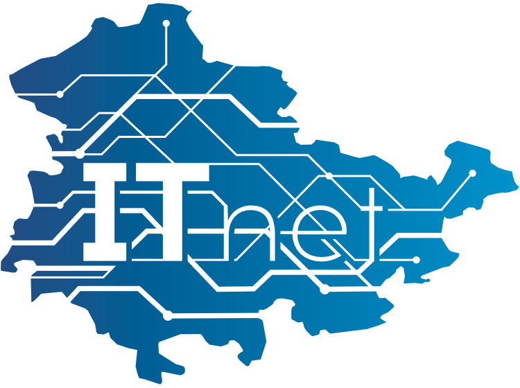

# ChargyTS Desktop App

[](https://github.com/OpenChargingCloud/ChargyDesktopApp/actions/workflows/ci.yml)
[](https://github.com/OpenChargingCloud/ChargyDesktopApp/actions/workflows/nightly.yml)

Chargy is a transparency software library for the validation of secure and transparent e-mobility charging processes, as defined by the *German Calibration Law ("Eichrecht")* in combination with the [Alternative Fuels Infrastructure Regulation (AFIR)](https://transport.ec.europa.eu/transport-themes/clean-transport/alternative-fuels-sustainable-mobility-europe/alternative-fuels-infrastructure_en) and the new [Measuring instruments (MID-11)](https://single-market-economy.ec.europa.eu/single-market/goods/european-standards/harmonised-standards/measuring-instruments-mid_en) of the European Commission and the [European Digital Quality Infrastructure](https://www.qi-digital.de/en/). The software allows you to verify the cryptographic signatures of energy measurements within charge detail records and comes with a couple of useful extentions to simplify the entire process for endusers and operators.

<kbd>
  
</kbd>

## Benefits of Chargy

1. Chargy comes with __*meta data*__. True charging transparency is more than just signed smart meter values. Chargy allows you to group multiple signed smart meter values to entire charging sessions and to add additional meta data like EVSE information, geo coordinates, tariffs, ... within your backend in order to improve the user experience for the ev drivers.
2. Chargy is __*secure*__. Chargy implements a public key infrastructure for managing certificates of smart meters, EVSEs, charging stations, charging station operators and e-mobility providers. By this the ev driver will always retrieve the correct public key to verify a charging process automatically and without complicated manual lookups in external databases.
3. Chargy is __*platform agnostic*__. The entire software is available for desktop and smart phone operating systems and .NET. If you want ports to other platforms or programming languages, we will support your efforts.
4. Chargy is __*Open Source*__. In contrast to other vendors in e-mobility, we belief that true transparency is only trustworthy if the entire process and the required software is open and reusable under a fair copyleft license (AGPL).
5. Chargy is __*open for your contributions*__. We currently support adapters for the protocols of different charging station vendors like chargeIT mobility, ABL (OCMF), chargepoint. The certification at the Physikalisch-Technische Bundesanstalt (PTB) is provided by chargeIT mobility. If you want to add your protocol or a protocol adapter feel free to read the contributor license agreement and to send us a pull request.
6. Chargy is __*white label*__. If you are a supporter of the Chargy project you can even use the entire software project under the free Apache 2.0 license. This allows you to create proprietary forks implementing your own corporate design or to include Chargy as a library within your existing application (This limitation was introduced to avoid discussions with too many black sheeps in the e-mobility market. We are sorry...).
7. Chargy is __*accessible*__. For public sector bodies Chargy fully supports the [EU directive 2016/2102](https://eur-lex.europa.eu/legal-content/EN/TXT/PDF/?uri=CELEX:32016L2102) on the accessibility of websites and mobile applications and provides a context-sensitive feedback-mechanism and methods for dispute resolution.


## Supported Charge Transparency Data Formats

Currently supported formats include:

- **Alfen** charge transparency data
- **Bauer** energy meter data (2 format variants)
- **ChargePoint** transparency data (2 format variants)
- **EDL40** and **ISA-EDL40 SML** data
- **EMH** energy meter data
- **Mennekes** XML
- **OCMF**, versions v1.1 to v1.4
  - Bonner Eichrechtstage **Tariff Text** Extensions
  - EdDSA support: Ed25519 and Ed448
  - Post-Quantum Cryptography support: ML-DSA-44, ML-DSA-65, ML-DSA-87
- **Porsche Charging Data Format (PCDF)**

Supported representations include:

- **Plain Files** containing a single charge transparency data set.
- **chargeIT Container Format**, a JSON-based container format for a single charging session (2 format variants).
- **Chargy Container Format**, a JSON-based container format for multiple charging sessions.
- **SAFE XML Container Format**, an XML-based container format for a single charging session, optionally enriched with additional Chargy metadata about the charging session.
- **PTB Container Format**, a JSON-based container format for a single charging session.
- **Archive formats** such as ***tar, ZIP, tar.gz***, and similar formats that combine or compress multiple charge transparency files.
- **QR-Code images**, such as ***PNG, JPG, JPEG or SVG files***, where the QR-Code represents a charge transparency data set.
- **PDF/A-3** files transporting a charge transparency file as an embedded additional data stream.
- **Charge Transparency Live Links**, a JSON-LD document describing a charging session that is still **running**: where its live data can be fetched, the public keys to verify it with, and the signed meter values measured so far. See [Charge Transparency Live Links](#charge-transparency-live-links) below.


## Sample transparency records

The `documentation/` folder carries example records for most of the formats above. They are meant to be **tried by hand**: load them from the start screen, drag them onto the window, or paste their content. Some of them also serve as the command line and HTTP API examples in [CLI.md](documentation/CLI.md) and [HTTPAPI.md](documentation/HTTPAPI.md).

| Folder | Contents |
|--------|----------|
| [`documentation/Alfen`](documentation/Alfen) | SAFE XML containers, including two that are supposed to **fail** verification, and the same session in the old and the new chargeIT container |
| [`documentation/ChargePoint`](documentation/ChargePoint) | ChargePoint records with their public keys, as `.chargy`, `.pem` and the raw signed payload |
| [`documentation/chargeIT`](documentation/chargeIT) | chargeIT containers in both format variants, the BSM/WS36A records under [`bsm/`](documentation/chargeIT/bsm) — ten of them **deliberately forged**, one value at a time: the meter id, the user id, the measured value, its scale, its unit, the start time, the end time — and the same data packed as `zip`, `tar`, `tar.gz` and `tgz` |
| [`documentation/GraphDefined`](documentation/GraphDefined) | A single session and a collection of sessions |
| [`documentation/XML`](documentation/XML) | An XML charge transparency container |

The forged and failing records are the interesting ones: a transparency software that accepts them is broken, so they are the quickest way to see that verification actually verifies.

These files are for manual use. The automated test suite has its own fixtures under `tests/fixtures/`.


## Charge Transparency Live Links

A charge transparency record describes a charging session that has **finished**. A charge transparency live link describes one that is still **running**: it carries what is already known — the station, the meter, the public keys, the signed meter values measured so far — and says where the next version of itself can be fetched.

Chargy reloads such a document while the session runs. Because the document comes from outside and may name any URL at all, several gates decide what is actually fetched:

- **The scheme**: only `https` and `wss`, and only hosts on the public internet. No document, setting or user decision widens this; only a [test bench run](#test-bench-runs) does.
- **`externalURLs.conf`**: an origin listed there is polled without asking anyone, and so is the application's own origin. `mode strict` in that file restricts polling to exactly those origins and never asks the user about any other.
- **The user**, for everything else: asked once per origin and remembered — trust on first use, revocable in the settings, expiring after six months without use. The remembered decisions are stored the way OpenSSH stores a hashed `known_hosts`: salted hashes rather than the origins themselves, so a copy of the store does not reveal where its owner charges.
- **Electron's main process**, which performs every request: it re-resolves the host and refuses private, reserved or otherwise non-public addresses, refuses credentials in the URL, allows only same-origin redirects within the approved prefix, times out, and caps the response size.

The polling period is what the document asks for, clamped: no faster than every 5 seconds, no slower than once a day, and 10 seconds when the document does not say. A transport may state HTTP headers to send with every request — a literal value, or a one-time password computed per request with [`@open-charging-cloud/totp`](https://www.npmjs.com/package/@open-charging-cloud/totp). What a document asks for is validated twice: once in the renderer and again in the main process, which is what opens the connection. Names a document has no business setting — `Host`, `Origin`, `Cookie`, `Sec-*`, … — are never sent.

The document format and what operators must provide are documented with [ChargyCore.TS](https://github.com/OpenChargingCloud/ChargyCore.TS/blob/master/tests/fixtures/ChargeTransparencyLive/README.md), which reads it — the same library this application and the WebApp both build on.

### Test bench runs

A test bench often speaks plain `http` and lives on the local network, which is exactly what the rules above refuse. Lifting either refusal is a decision for whoever runs the application, never for the document and never for a setting a user could be talked into flipping while Chargy is open — so it is taken once, at startup, from the command line:

```
npm run start:testbench                        # both switches
electron . --allow-insecure-transports         # plaintext http:// and ws://
electron . --allow-private-network-transports  # hosts on the local network
```

The same switches can be asked for with the environment variables `CHARGY_ALLOW_INSECURE_TRANSPORTS=1` and `CHARGY_ALLOW_PRIVATE_NETWORK_TRANSPORTS=1`, which is what the WebApp takes too.

**A packaged Chargy never takes them, whatever asks.** They only apply to a checkout being run by a developer, and a run that has one of them on says so on both consoles. The main process resolves the switches and hands the answer to the renderer, so the half that decides to poll and the half that opens the connection can never disagree about what is allowed.


## Editions, Versions and Milestones

Version 1.2.x of the Chargy Transparency Software was reviewed and certified by [Verband der Elektrotechnik Elektronik Informationstechnik e.V. (VDE)](https://www.vde.com/de). If you are a charge point vendor and want to use this software to verify the compliance with the German Eichrecht you can talk to our partner [ChargePoint](https://www.chargepoint.com/de-de/) and obtain the required legal documents.

Version 1.0.x of the Chargy Transparency Software was reviewed and certified by [Physikalisch-Technische Bundesanstalt (PTB)](https://www.ptb.de). If you are a charge point vendor and want to use this software to verify the compliance with the German Eichrecht you can talk to our partner [chargeIT mobility](https://www.chargeit-mobility.com) and obtain the required legal documents.

If you need help with the Chargy Transparency Software or want to include your smarty energy meter or transparency data format, talk to [us](https://open.charging.cloud).

This software is also available as [WebApp](https://github.com/OpenChargingCloud/ChargyWebApp).


## Future

The development of version **v2.x** already started and will focus on enhanced security concepts, more digital certificates and pricing information.


## Credits

- <a href="https://github.com/sirhcel">Christian Meusel</a> for some more BSM validations.


## Funding

This Open Source project is partially funded by the [NGI Zero Commons Fund](https://nlnet.nl/commonsfund/) as part of our [EVQI project](https://nlnet.nl/project/EVQI/).

We also appreciate any additional funding and long-term support for the Chargy family, for example via [GitHub Sponsors](https://github.com/sponsors/GraphDefined), as it helps us keep the project sustainable, independent and useful for the entire e-mobility community.

<center>
  
</center>


## Awards

The Chargy Transparency Software is one of the winners of the [1. Thuringia's Open-Source Prize](https://www.it-leistungsschau.de/programm/TOSP2019/) </a> in March 2019. This prize was awarded by [Wolfgang Tiefensee](https://de.wikipedia.org/wiki/Wolfgang_Tiefensee), [Thuringia’s Secretary of Commerce](https://www.thueringen.de/th6/tmwwdg/), in conjunction with the board of directors of the IT industry network [ITNet Thuringia](https://www.itnet-th.de).

<center>
   
</center>
