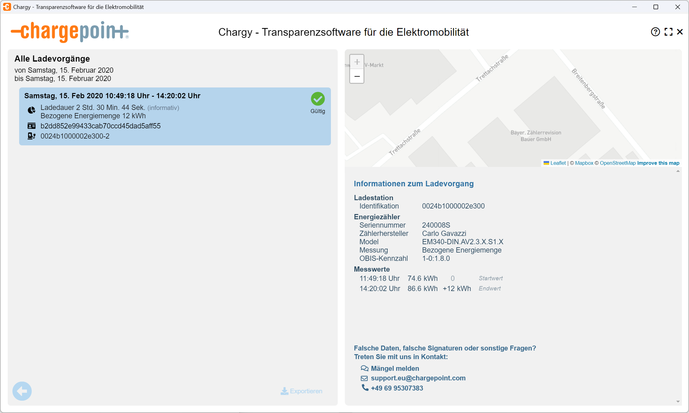
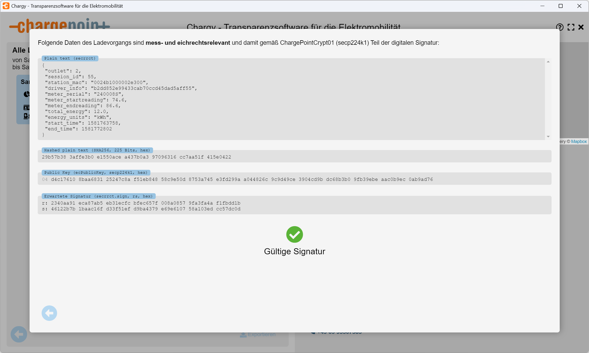

# ChargePoint Transparency

The ChargePoint _Charge Transparency Records_ are available in two versions, and they uniquely separate the transparency data, its digital signature and the public key into distinct files.

The positive aspect of this is, that you could simply use **OpenSSL** to verify those digital signatures. But keep in mind, that the purpose of a transparency software is also to verify the plausibility of the transparency data itself.

```
openssl dgst -sha256 -verify 0024b1000002e300_2.pem -signature 0024b1000002e300_2_119693895_payload/secrrct.sign 0024b1000002e300_2_119693895_payload/secrrct
```

To make your life a bit easier the Chargy transparency software allows you to compress all files together into e.g. a TAR or ZIP file and just drag&drop it into the application.


## The older ChargePoint transparency format

From the directory `documentation\ChargePoint\Testdata-2020-02` select the files `0024b1000002e300_2_123017065_payload.tar.bz2` containing the transparency records and `0024b1000002e300_2.pem` containing the public key of the EVSE of the associated charging station.





1. When you select **multiple public key files**, e.g. `0024b1000002e300_2.pem` and `0124a500402e1300_2-publicKey.pem` the transparency software will automatically iterate over all public keys and stop as soon as it found a valid signature. Also the file name of the public key file is not important, see `like_0024b1000002e300_2_butWrongFileName.pem`.

2. The transparency file `0024b1000002e300_2_123017065_payload.tar.bz2` is actually a compressed archive having two files: `secrrct` the transparency data and `secrrct.sign` the digital signature over the transparency data ***as it is*** within this file. No normalization *(minification)* of the JSON data is applied before creating or validating the digital signature, so you have to keep an eye on e.g. whitespaces and line breaks that might break the signature in unexpected ways.

3. The transparency records in `0024b1000002e300_2_123017065_payload.tar.bz2` can also be used in combination with `0024b1000002e300_2-publicKey.chargy` which provides the associated public key and a digital signature for it in the Chargy format.

4. The transparency records in `0024b1000002e300_2_123017065_payload.tar.bz2` can also be used in combination with `0024b1000002e300_2-publicKey_minimal.chargy` which provides the associated public key and a digital signature for it a minimal Chargy format.

5. The transparency format used does not include additional CPO information. Nevertheless Chargy supports additional *EVSE Id*, *address* and *geo location* information within the signed part of transparency record. Within `documentation\ChargePoint\Testdata-2020-02extended` you will find a corresponding example. 

