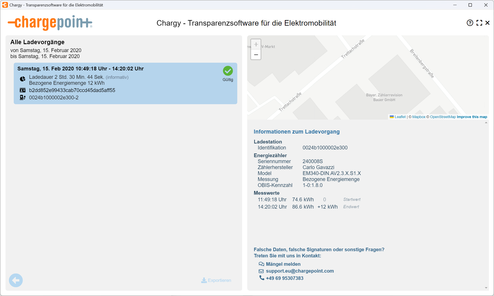
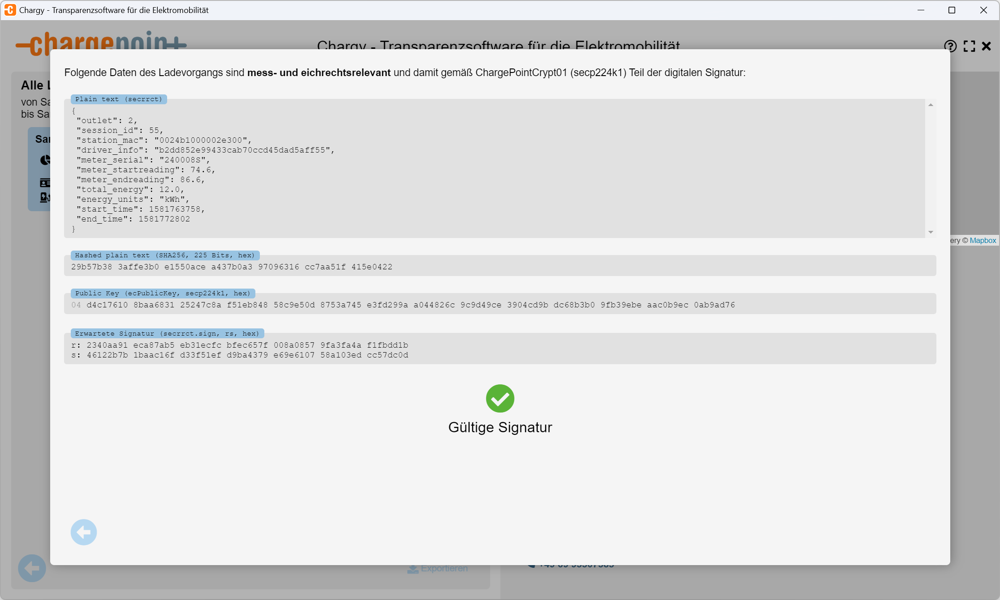

# ChargePoint Transparency

The ChargePoint _Charge Transparency Records_ are available in two versions, and they uniquely
separate the transparency data, its digital signature and the public key into distinct files.

To make your life easier you can compress all together into e.g. a ZIP file and just drag&drop
it into the transparency software.

## Example of the older transparency format

