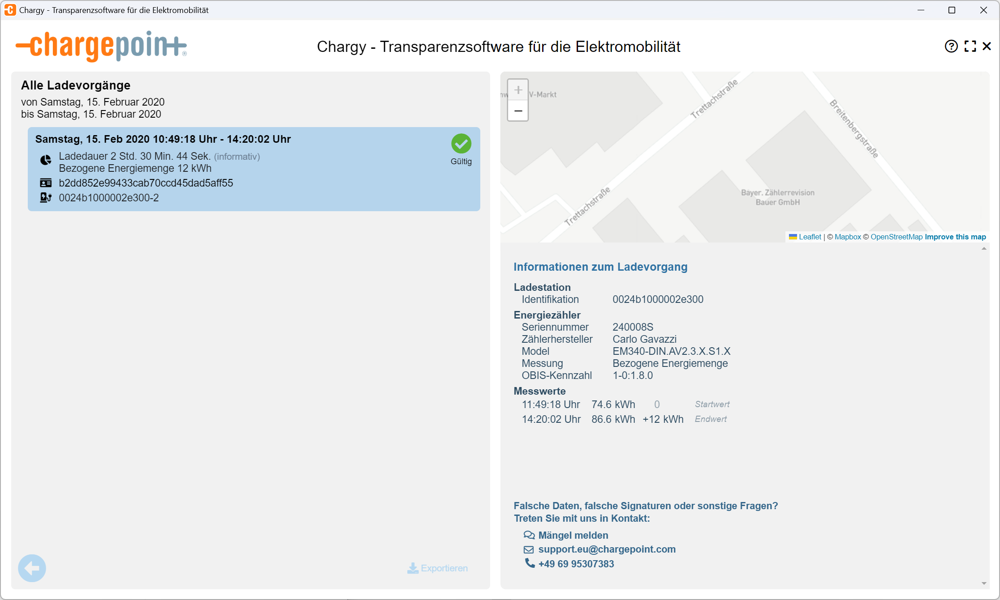
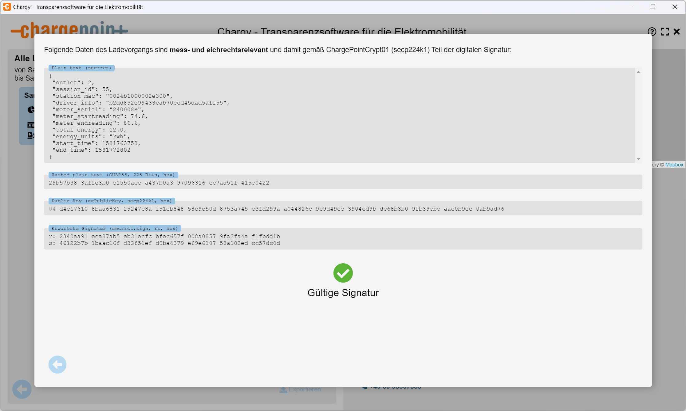

# ChargePoint Transparency Format

ChargePoint transparency records separate the signed transparency payload, the
digital signature and the public key into different files. Chargy can read these
files individually or from common archive containers such as ZIP, TAR, GZIP and
BZIP2.

Unlike formats such as OCMF or Mennekes EDL40, ChargePoint does not sign each
meter reading separately. The complete ChargePoint `secrrct` payload is signed
once. Chargy verifies that session-level signature and then exposes the start
and stop meter readings as normal Chargy measurement values.

## Transport Shapes

ChargePoint data commonly appears in one of these forms:

| Shape | Files | Notes |
|-------|-------|-------|
| Raw payload archive | `secrrct`, `secrrct.sign` | Usually delivered as `*_payload.tar.bz2`. Needs an external public key file for verification. |
| Combined archive | `secrrct`, `secrrct.sign`, public key | ZIP or `.chargy` files can contain all required files. |
| JSON charge transparency record | `*.chargy` | Already converted Chargy JSON, optionally with public key information. |
| Public key file | `*.pem`, `*publicKey*.chargy`, hex DER | Can be supplied beside the payload archive. |

The recommended user workflow is to drag the payload archive and the matching
public key file into Chargy together. When the public key is missing, Chargy can
still parse the record but reports `PublicKeyNotFound`.

## Raw Payload Files

The old ChargePoint transport uses two payload files:

```text
secrrct
secrrct.sign
```

`secrrct` is a JSON document encoded as UTF-8. `secrrct.sign` is the ECDSA
signature over the exact `secrrct` byte content. Chargy keeps the original
payload bytes as Base64 internally so that whitespace and field ordering remain
available for signature verification.

Compressed payload examples in this repository use names like:

```text
0024b1000002e300_2_123017065_payload.tar.bz2
```

Chargy detects the archive, extracts `secrrct` and `secrrct.sign`, parses the
JSON payload, attaches the signature and converts the result into the internal
Chargy CTR model.

## JSON Payload Variants

Chargy currently recognizes two ChargePoint JSON structures.

### Legacy Billing-Oriented Payload

The legacy payload has top-level billing arrays and an `additional_info` object:

```json
{
  "company_name": "ChargePoint EU QA EUR",
  "display_unit": 3600,
  "energy": [
    {
      "start_time_utc": 1543837908,
      "end_time_utc": 1543838329,
      "units": 0.059,
      "type": "ENERGY"
    }
  ],
  "parking": [
    {
      "start_time_utc": 1543837908,
      "end_time_utc": 1543838329,
      "units": 421,
      "type": "PARKING"
    }
  ],
  "subtotal": 0.07,
  "totalAmount": 0.08,
  "additional_info": {
    "outlet": 2,
    "session_id": 2,
    "station_mac": "0024:b100:0002:e300",
    "driver_info": "urn:nema:5evse:dn:v1:chargepoint.com:cdid:cncp000009afd2",
    "meter_serial": "240008S",
    "currency_code": "EUR",
    "meter_startreading": 3078,
    "meter_endreading": 3137,
    "energy_units": "Wh"
  }
}
```

Chargy derives the session start and end from the energy and parking intervals.
If the energy array is missing, parking timestamps are used as a fallback.

### Compact Session Payload

Newer examples use the relevant session values directly at the top level:

```json
{
  "outlet": 2,
  "session_id": 55,
  "station_mac": "0024b1000002e300",
  "driver_info": "b2dd852e99433cab70ccd45dad5aff55",
  "meter_serial": "240008S",
  "meter_startreading": 74.6,
  "meter_endreading": 86.6,
  "total_energy": 12.0,
  "energy_units": "kWh",
  "start_time": 1581763758,
  "end_time": 1581772802
}
```

This shape maps directly to one Chargy session with one `1-0:1.8.0` energy
measurement and two values.

## Public Keys

ChargePoint public keys are supplied separately from the signed payload. Chargy
accepts:

| File type | Example | Notes |
|-----------|---------|-------|
| PEM/SPKI | `0024b1000002e300_2.pem` | Standard `-----BEGIN PUBLIC KEY-----` file. |
| Chargy public key JSON | `0024b1000002e300_2-publicKey.chargy` | `https://open.charging.cloud/contexts/publicKey+json`. |
| Minimal Chargy public key JSON | `0024b1000002e300_2-publicKey_minimal.chargy` | Smaller JSON form accepted by the parser. |
| Hex DER | `*publicKey*.txt` or similar | Hex encoded SPKI DER public key. |

When reading DER/SPKI keys, Chargy extracts:

| OID | Meaning |
|-----|---------|
| `1.2.840.10045.2.1` | EC public key |
| `1.3.132.0.32` | secp224k1 |
| `1.2.840.10045.3.1.7` | secp256r1 / prime256v1 |
| `1.3.132.0.34` | secp384r1 |
| `1.3.132.0.35` | secp521r1 |

The public key id is derived from the file name by removing common
`publicKey`, `public-key` or `public_key` suffixes. For a payload with EVSE id
`0024b1000002e300-2`, the matching public key file normally starts with the
same base identifier.

If no exact id match exists and exactly one public key is available, Chargy tries
that key as a fallback.

## Signature Verification

The signature is stored in `secrrct.sign`. It is usually ASN.1 DER encoded
ECDSA. Chargy converts DER signatures into raw `r` and `s` components before
verification.

The signed text is the exact original `secrrct` content:

```text
plainText = original bytes of secrrct
```

The hash and curve depend on the public key:

| Curve | Hash | Verification |
|-------|------|--------------|
| secp224k1 | SHA-256, reduced for the custom secp224k1 verifier | Custom `secp224k1` verifier |
| secp256r1 | SHA-256 | `elliptic` P-256 |
| secp384r1 | SHA-384 | `elliptic` P-384 |
| secp521r1 | SHA-512 | `elliptic` P-521 |

Older ChargePoint examples in this repository use secp224k1. Newer generated
test material also covers secp256r1.

## Chargy Mapping

After parsing, Chargy creates one charge transparency record with one charging
session.

| ChargePoint source | Chargy field |
|--------------------|--------------|
| `station_mac` | charging station id |
| `outlet` | part of EVSE id |
| `session_id` | part of session id |
| `driver_info` | authorization id |
| `meter_serial` | meter id |
| `meter_startreading` | first measurement value |
| `meter_endreading` | final measurement value |
| `energy_units` | measurement unit |
| `start_time` / `start_time_utc` | session and start-value timestamp |
| `end_time` / `end_time_utc` | session and stop-value timestamp |

The resulting measurement uses:

```text
OBIS: 1-0:1.8.0
Name: Bezogene Energiemenge
```

Individual measurement values have no own signatures. Before session signature
verification succeeds, their result is `NoOperation`; after a valid session
signature, Chargy displays them as `StartValue` and `StopValue`.

## Archive Handling

Chargy recursively expands supported archives. For ChargePoint this matters
because payloads are often nested as:

```text
*.tar.bz2
  secrrct
  secrrct.sign
```

or combined as:

```text
*.zip
  secrrct
  secrrct.sign
  0024b1000002e300_2.pem
```

`.chargy` files are also accepted when they contain the already converted Chargy
CTR JSON or a public-key JSON object.

## Complete Example Set

The main test fixture set lives in:

```text
tests/fixtures/ChargePoint/Testdata-2020-02/
```

Important files:

| File | Purpose |
|------|---------|
| `0024b1000002e300_2_123017065_payload.tar.bz2` | Payload archive with `secrrct` and `secrrct.sign`. |
| `0024b1000002e300_2.pem` | Matching PEM public key. |
| `0024b1000002e300_2-publicKey.chargy` | Matching public key as Chargy JSON. |
| `0024b1000002e300_2-publicKey_minimal.chargy` | Minimal public key JSON. |
| `0024b1000002e300_2.chargy` | Combined/converted Chargy data. |
| `0024b1000002e300_2_123017065_withPublicKey.zip` | Payload plus public key in one ZIP. |

Without a public key, Chargy parses the session but reports:

```text
PublicKeyNotFound
```

With the matching public key, the same payload verifies as:

```text
ValidSignature
```

## Example Screenshots

The following screenshots show the older ChargePoint transparency format:




