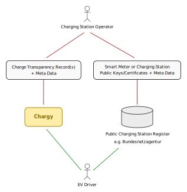

# Chargy - Transparency Software for E-Mobility Applications

Chargy is a transparency software for secure and transparent e-mobility charging processes, as defined by the German "Eichrecht". The software allows you to verify the cryptographic signatures of energy measurements within charge detail records and comes with a couple of useful extentions to simplify the entire process for endusers and operators.

## Introduction and Goals

As a driver of electric vehicles you have to tacle a couple of well-known
challenges: Where and when do I charge my vehicle and will I receive a
correct invoice for this process? To solve these issues the German Eichrecht
defines a legal foundation how to measure time and energy in a trustworthy
way, how to sign and store these measurments via digital signatures and how
to send these data to the endusers. You can think of this as a digital
receipt of the charging time, amount of consumed energy and the resulting
costs. Later in time an enduser can use a so called "transparency software"
to verify the correctness of these receipts and to prove possible mistakes.

Although the high demands of correctness and transparency in e-mobility
charging seem to be obvious, surprisingly no Open Source transparency
software was available until now. By this the goal of transparency was
actually not achieved, as even experienced endusers can not distinguish
between a wrong receipt and bugs within a closed source transparency
software. In the same way the legal situation of consumers had not been
improved significantly.

## Scope of the work

It is the legal duty of a charging station vendor and operator to provide
all the required tools to verify a receipt. Chargy is a such a tool and
helps endusers to understand the origin and composition of all expenses
independend of their desktop computer and smart phones. For special
regulatory tasks even a special Chargy Linux-Live-DVD exists.

## Stakeholders

Roll | Description | Expectations                 
-- | -- | -- 
EV Drivers | | A common and vendor independent transparency and verification of their charging processes
Open Source Community | Initiative of GraphDefined, chargeIT mobility and Wiedergrün | Providing a standardized solution
PTB (Working Group 8.51 Metrology Software) | National Metrology Institute of the Federal Republic of Germany | Regulatory verification of the software
Charging Station Vendors | | Providing data and protocols for the verification of charging processes
Charging Station Operators | | Providing a common software for the verification of charging processes to their direct customers and e-mobility providers
E-Mobility Providers | | Providing a common software for the verification of charging processes to their customers

## Constraints

Chargy exists within a highly regulated environment. The following constraints exists.

### Technical Constraints

Constraint | Description, Background                  
-- | -- 
Support of Linux-, Mac OS X and Windows-Desktop-Operating Systems | The software must run on Windows 10+ and Mac OS X. Aditionally it must run on Linux, in order to provide Live-DVD or USB-Stick. 
Support on iOS- and Android Smart Phone-Operating Systems | The software muss run on current iOS and Android smart phones.
Limited cryptography | Most charging station vendors only support a single elliptic curve cryptography algorithm, e.g. secp192r1 and export only public keys instead of digital certificates of charging stations.

### Regulatory Constraints

Constraint | Description, Background                  
-- | -- 
Frozen Versions | The cryptographic hash value of a specific version of the software is part of a legal document. Automatic updates without user interaction is not possible.
Smart Meter Regulations | Some charging station vendors implement their requirements via smart meters. Therefore additional regulatory requirements occur.
Accessibility | Charging station owners might be public sector bodies which have to support [EU directive 2016/2102](https://eur-lex.europa.eu/legal-content/EN/TXT/PDF/?uri=CELEX:32016L2102) on the accessibility of websites and mobile applications.

## Approach

By using the well-known frameworks [Apache Cordova](https://cordova.apache.org/)
and [Electron](https://electronjs.org) we created a platform independent and
Open Source transparency software. This software can process the (still) very
different data formats of different charging station providers and verify their
correctness by using cryptographic algorithms. Besides this, Chargy is the first
transparency software in the market which does not only implement the minimal
requirements of the German regulators like the Physikalisch-Technische
Bundesanstalt (PTB), but tries to put the enduser into the center of any
development. This means Chargy does not only show additional information
about charging stations, their geo coordinates, addresses, tariffs and
includes an issue tracker. This all is done to give the ev driver the best
experience, to help him evaluate the correctness of the charging process
and to support him when something seems to be wrong.

## Data Flow

The following describes the data flow and the actors.

Entity | Description                  
-- | -- 
Charging Station Operator | The operator of charging stations selling energy to EV drivers.
EV Driver | An enduser who wants to charge its electric vehicle and understand the resulting costs.
Charge Transparency Record | A data record about the charging process including at least charging time, consumed energy and a digital signature. May include additional signed or unsigned meta data to support the ev driver.
Public Key(s)/Certificates | The charging station operator publishes its charging stations within a public register.
Public Charging Station Register | The charging station register acts as trusted source of charging station meta data, esp. public keys for the verification of charge transparency records.

